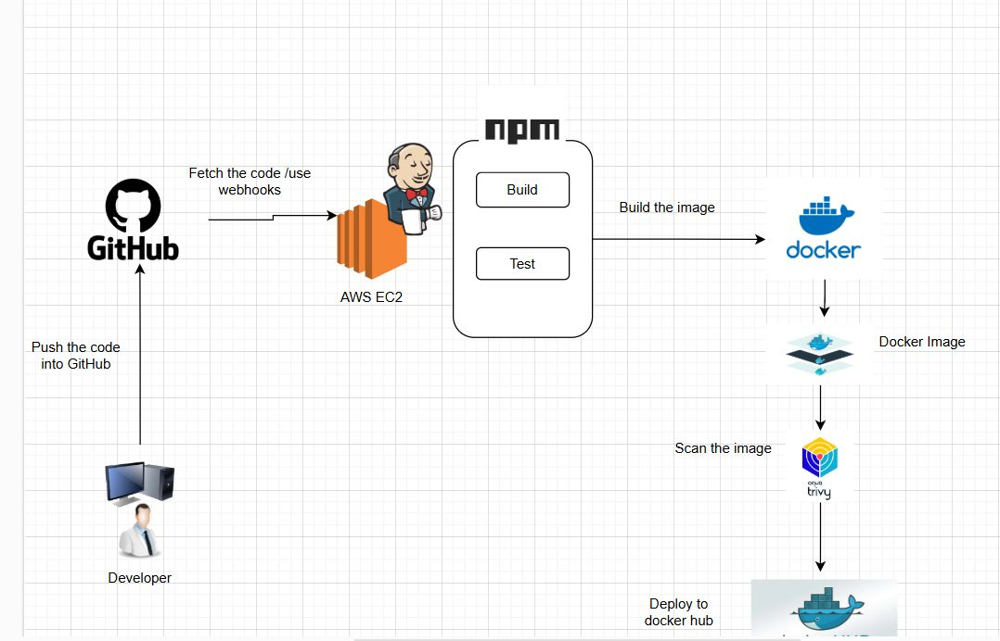

# 🚀 Express API with CI/CD using Jenkins, Docker, and Trivy

This project is a Node.js Express REST API integrated with a complete CI/CD pipeline using **Jenkins**, **Docker**, and **Trivy** for image scanning. It automatically installs dependencies, runs tests, builds a Docker image, scans it, and pushes to Docker Hub.

---

## 📸 Project Architecture

<p align="center">
  
</p>


---

## 🧠 Features

- REST API with Express
- CI/CD with Jenkins Pipeline
- Dockerized app
- Security scan using Trivy
- Automatic push to Docker Hub
- MongoDB database connection

---

## 🛠️ Tech Stack

| Layer        | Tool/Tech             |
|--------------|-----------------------|
| Backend      | Node.js, Express      |
| CI/CD        | Jenkins, Docker       |
| Security     | Trivy                 |
| Database     | MongoDB Atlas         |
| OS/Runtime   | Ubuntu, PM2 (optional) |

---


---

## ⚙️ How to Run Locally

```bash
# Clone the repo
git clone https://github.com/KavishkaSasindu/express-api-CI-CD.git
cd express-api-CI-CD

# Install dependencies
npm install

# Connect to MongoDB - edit MONGO_URL in a .env file
touch .env
echo "MONGO_URL=<your-mongodb-connection>" >> .env

# Run the app
node app.js
```

## Jenkins Pipeline Setup

use aws and create an EC2 for install jenkins and other things
```bash
sudo apt update
sudo apt install docker.io -y
sudo systemctl start docker
sudo usermod -aG docker jenkins

# Install Trivy
sudo apt install wget -y
wget https://github.com/aquasecurity/trivy/releases/latest/download/trivy_0.49.1_Linux-64bit.deb
sudo dpkg -i trivy_0.49.1_Linux-64bit.deb

#install node js
```

## 🛠️ 2. Create Jenkins Pipeline Job

1. Open Jenkins and go to **New Item**
2. Enter a name (e.g., `express-api-ci-cd`) and select **Pipeline**
3. Under **Pipeline Configuration**, scroll to the **Pipeline** section:
   - **Definition**: `Pipeline script from SCM`
   - **SCM**: `Git`
   - **Repository URL**:  
     ```
     https://github.com/KavishkaSasindu/express-api-CI-CD.git
     ```
   - **Script Path**:  
     ```
     Jenkinsfile
     ```

💡 **Pro Tip:** Add your DockerHub credentials securely:
- Go to: `Jenkins → Manage Jenkins → Credentials → Global → Add Credentials`
- **Type**: Secret Text  
- **ID**: `dockerhub-password`  
- **Secret**: Your DockerHub access token or password

---

## 🔐 Environment Variables

| Variable    | Description                    |
|-------------|--------------------------------|
| `MONGO_URL` | MongoDB Atlas URI connection   |
| `PORT`      | Port to run Express app        |

now run the pipeline

